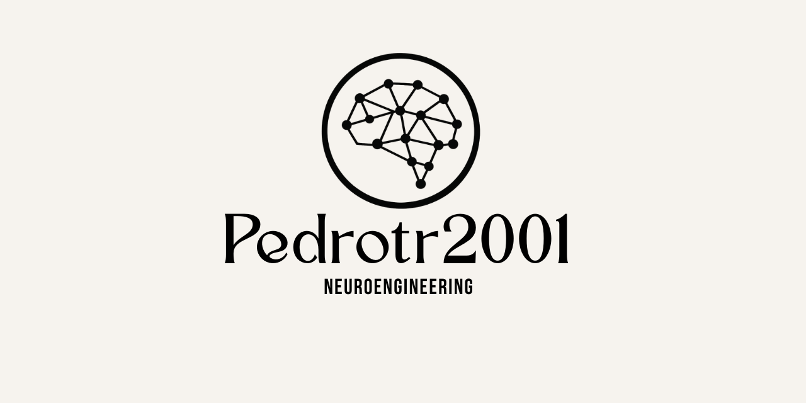

# Pedrotr2001
<a href="">
  <picture>
    <source media="(prefers-color-scheme: light)" srcset="pedrotr2001.png">
    <source media="(prefers-color-scheme: dark)" srcset="pedrotr2001.png">
    
  </picture>
</a>

 👋 Hey, I'm Pedro Torres Ramos. 

🧠 Aspiring Neuroengineer (yeah, brain + tech = magic)  
💻 I write code… sometimes it works, sometimes I learn  
☕ Powered mostly by RedBull and curiosity  

### 🚀 About Me
🩺 Medical doctor from the University of Salamanca — fluent in medicine, caffeine, and last-minute study sessions  
🔬 Interested in AI, the brain, and technology  
🧩 I like understanding how things work (and breaking them in the process)  
🛠️ Always building projects… or at least starting them 😅  
🌍 Trying to make the world a bit more interesting  

### 🧪 Currently
🏥 I am Neurophisiologist and Biomedical Engineering student  
🤖Learning about Neuroengineering  
👨‍💻Experimenting with code, ideas, and useful mistakes  
🤔Trying not to overthink EVERYTHING  

### ⚡ Fun Facts
🧠 I think the brain is the most interesting hardware out there  
💤 My best ideas come when I’m not working  
🎯 50% coding, 50% debugging, 100% confusion  

### 📫 Contact
GitHub: right here 👀  
Email: pedrotrprogramming@gmail.com  
LinkedIn: [Pedro Torres Ramos](https://www.linkedin.com/in/pedro-torres-ramos-3ba073234)  

“If it works, don’t touch it. If it doesn’t… maybe don’t touch it either.”

# Projects
Working on them!🔧
